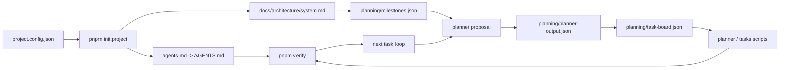

# Codex Harness Foundry

[](https://github.com/dawid0309/Codex-Harness-Foundry/actions/workflows/ci.yml)
[](./LICENSE)
[](https://github.com/dawid0309/Codex-Harness-Foundry/generate)

**An open-source Codex workbench where engineers design the environment, write intent into the repo, and let AI agents execute against repository truth.**

Chinese assist: a repo-native Codex workbench for long-running projects, with context, milestones, task orchestration, and verification built into the repository.

- Codex usually works from chat memory. Codex Harness Foundry makes it work from repository truth.
- Work moves through milestones, task cards, role boundaries, and verification instead of ad hoc prompting.
- Use it when you need Codex to keep shipping across a real project, not just generate one-off code.

[Use this template](https://github.com/dawid0309/Codex-Harness-Foundry/generate) | [Quick Start](#quick-start) | [Fork and Initialize](./docs/runbooks/fork-and-init.md)

## Problem And Why It Exists

Typical AI coding workflows keep critical context in chat, not in the repository.

- Context lives in chat history and ad hoc prompts.
- Task state is implicit, fragile, or manually reconstructed.
- Handoffs disappear once the conversation moves on.
- Verification is optional, so "done" is hard to trust or replay.

Codex Harness Foundry fixes that by storing context in repo files, advancing work through milestones and task cards, and enforcing a shared verify path.

- Repo-native context from `project.config.json`, `AGENTS.md`, architecture docs, milestones, and the task board.
- `AGENTS.md` as a short directory page that points to canonical source files instead of duplicating them.
- A planner -> builder -> verifier operating model with explicit ownership boundaries.
- Persistent execution state through milestone blueprints, task cards, and next-task recommendation.
- Verification and feedback loops as first-class gates instead of best-effort afterthoughts.

## How It Works



Codex Harness Foundry turns a repo into an operating surface for Codex: configure the environment, record the current intent, verify the feedback loop, and keep moving from the next recommended task.

## 30-Second Demo


Initialize a project, run verification, and get the next task from repo state. This is a repo-native workflow, not a chat screenshot.

```powershell
pnpm install
pnpm init:project -- --name "Demo Product" --slug "demo-product" --goal "Ship a verifiable Codex workflow" --stack "Next.js, TypeScript, pnpm" --owner "your-github-user" --repoName "demo-product"
pnpm verify
pnpm planner:next
```

The asset is stored in [`docs/assets/readme/`](./docs/assets/readme/). Regeneration notes live in [docs/runbooks/readme-demo.md](./docs/runbooks/readme-demo.md).

## Quick Start

1. Use [this template](https://github.com/dawid0309/Codex-Harness-Foundry/generate) or fork the repository.
2. Install dependencies:

```powershell
pnpm install
```

3. Initialize your project metadata:

```powershell
pnpm init:project
```

4. Run the standard workflow bootstrap:

```powershell
pnpm verify
pnpm planner:next
```

5. Export tracked issue drafts when you want repo-reviewed GitHub issue replies:

```powershell
pnpm issues:export
```

6. For deeper setup, follow the [fork and initialize runbook](./docs/runbooks/fork-and-init.md).
7. For the human role in the loop, read the [engineer loop runbook](./docs/runbooks/engineer-loop.md).

## Concrete Use Case

Imagine a solo builder or small team using Codex to push a 2-6 week product effort.

Before Foundry:

- Codex starts from chat memory instead of repository truth.
- Planner, builder, and reviewer behavior blend together in one long thread.
- Milestones, handoffs, and verification results are hard to preserve or replay.

With Foundry:

- The project identity, environment, intent, milestones, and task board live in the repo.
- Codex can operate with planner / builder / verifier boundaries instead of one undifferentiated loop.
- Verification, next-task recommendation, role ownership, and issue feedback stay visible across the whole project.

This is for teams who want Codex to keep progressing through a real software project, not just produce isolated code snippets.

## Who It's For / Not For

### It's For

- Teams or solo builders using Codex on medium- to long-running projects.
- People who want planner / builder / verifier separation instead of one mixed chat loop.
- Builders who want AI workflow state, decisions, and verification evidence to live in the repository.
- Anyone maintaining a reusable Codex operating template across multiple downstream repos.

### It's Not For

- One-off prompt coding or quick debugging sessions.
- Users who do not want repo-level process, milestones, or task tracking.
- Projects without a meaningful verification path.
- Teams looking for a generic autonomous agent platform rather than a Codex-centered delivery workflow.

## Compared With Typical AI Coding Workflows

| Dimension | Typical AI Coding Workflow | Codex Harness Foundry |
| --- | --- | --- |
| Source of context | Chat history and ad hoc prompts | Repo-native context from project config, index-style `AGENTS.md`, architecture docs, intent docs, milestones, and task board |
| Task tracking | Implicit or manual | Milestones, task blueprints, live task-board state, and next-task recommendation |
| Role boundaries | Single mixed workflow | Planner / builder / verifier operating model with explicit ownership |
| Verification | Optional and inconsistent | Standard verify flow validates environment, intent, issue export, typecheck, and smoke |
| Handoff persistence | Mostly lost in chat | Designed to preserve context, handoffs, decisions, and review artifacts in the repo |
| Fit for long-running work | Weak once context grows | Built for repeatable, milestone-driven project progression |

## Commands

Start here:

- `pnpm init:project`
- `pnpm verify`
- `pnpm planner:next`
- `pnpm tasks:status`

Full reference:

| Command | Purpose |
| --- | --- |
| `pnpm init:project` | Interactively initialize a fork with its own project metadata and reset the task board |
| `pnpm sync:project` | Reapply `project.config.json` to the package metadata and core docs |
| `pnpm compose:agents` | Generate repo-local `AGENTS.md` files from `agents-md/` fragments |
| `pnpm planner:propose` | Generate a planner proposal artifact in `planning/planner-output.json` |
| `pnpm planner:publish` | Accept planner output into `planning/task-board.json` as leader/orchestrator |
| `pnpm planner:refresh` | Compatibility shortcut that runs `planner:propose` and `planner:publish` together |
| `pnpm planner:next` | Print the next recommended ready tasks |
| `pnpm next-milestone:propose` | Generate a follow-on milestone proposal in `planning/next-milestone-output.json` when the final milestone is complete |
| `pnpm next-milestone:publish` | Accept the next milestone proposal into `planning/milestones.json` as leader/orchestrator |
| `pnpm tasks:plan` | Show the current actionable task plan |
| `pnpm tasks:status` | Show the task board summary and task list |
| `pnpm tasks:update -- <task-id> <status>` | Update a task status in `planning/task-board.json` |
| `pnpm issues:export` | Generate deterministic repo-first issue drafts into the configured feedback directory |
| `pnpm smoke` | Validate that planning files are structurally usable |
| `pnpm typecheck` | Type-check the automation scripts |
| `pnpm verify` | Run the config-backed verification gate from `project.config.json.verification` |
| `pnpm harness:run -- --target <target-id>` | Execute one full harness cycle against a registered target repo in the foreground |
| `pnpm harness:eval -- --target <target-id> --run-id <run-id>` | Re-run the evaluator for an existing target run |
| `pnpm harness:resume -- --target <target-id> --run-id <run-id>` | Resume an interrupted target run from its checkpoint |
| `pnpm harness:doctor -- --target <target-id>` | Validate adapter prerequisites and target registration health |
| `pnpm harness:worker:start -- --target <target-id>` | Start a background harness worker that keeps advancing ready work for a target |
| `pnpm harness:worker:status -- --target <target-id>` | Inspect target-scoped background harness worker state from `data/harness/targets/<target-id>/` |
| `pnpm harness:worker:stop -- --target <target-id>` | Stop the active background harness worker for a target |
| `pnpm harness:worker:resume -- --target <target-id>` | Resume the latest or specified background harness run for a target |
| `pnpm harness:dashboard` | Open the local dashboard server for monitoring and controlling registered targets |

## Repository Layout

```text
agents/          Role briefs for planner, builders, and verifier
agents-md/       Source fragments used to compose repo-aware AGENTS.md files
docs/            Architecture notes, runbooks, templates, and experiment logs
planning/        Milestone definitions and live task-board state
scripts/         Planner, task, smoke, and verification scripts
src/             Product code for the real project built from this template
tests/           Automated tests and regression coverage
```

`planning/planner-output.json` is the planner-owned task-publication artifact. `planning/next-milestone-output.json` is the planner-owned roadmap-extension artifact. `planning/task-board.json` remains the leader-approved execution state.

## FAQ

**Is this a framework?**

Not in the usual sense. It is a repo-native Codex operating template for context, planning, orchestration, and verification.

**Is this only for Codex?**

The repo is opinionated around Codex-style workflows and prompts, but the core ideas are portable if you want repo-native AI collaboration.

**Do I need multiple agents to use it?**

No. A solo builder can still use the planner / builder / verifier model as a disciplined workflow inside one project.

## Customizing the Template

At minimum, initialize the project and then review these files before using the template for a real product:

- `project.config.json`
- `docs/intent/current.md`
- `docs/architecture/system.md`
- `docs/feedback/loop.md`
- `planning/milestones.json`
- `agents-md/00-project.agents.md`
- `agents-md/30-product.agents.md`
- `agents/` role briefs if your team split differs from planner / UI / engine / content / verifier

If you derive a new product from this template, treat `src/` and `tests/` as the places for product code. Keep the planning and documentation structure intact so Codex can continue to operate from stable repo state.

## Verification Philosophy

`pnpm verify` is the baseline quality gate for every meaningful change. It is configured from `project.config.json.verification.stages`, where each stage defines:

- `id`
- `label`
- `command`
- `enabled`

The default template stages now:

1. syncs project metadata from `project.config.json`
2. recomposes `AGENTS.md`
3. refreshes the task board
4. exports repo-first issue drafts
5. type-checks the automation scripts
6. runs a smoke validation of environment, intent, and feedback records

If you extend the template into a real product, add your app-specific checks to the same verification path rather than creating separate hidden gates.

## Issue Export Workflow

Issue planning notes can live in the repo and still export cleanly to GitHub-facing Markdown.

- Track observations in `project.config.json.feedback.observationsPath`
- Generate drafts with `pnpm issues:export`
- Review generated files in `project.config.json.feedback.issueDraftDirectory`
- Follow the [issue export runbook](./docs/runbooks/issues-export.md) when mapping drafts to GitHub issues

The template intentionally owns one source schema, one renderer, and one default export path so issue replies do not drift across multiple scripts.

## Harness Worker

For longer Codex CLI runs, the template can supervise one continuous background harness worker per registered target at a time.

- Configure adapters in `harness.manifest.json`
- Register external targets in `harness.targets.json`
- Keep target-specific backlog and prompts under `targets/<target-id>/`
- Start with `pnpm harness:worker:start -- --target <target-id>`
- Check state with `pnpm harness:worker:status -- --target <target-id>`
- Stop or resume with `pnpm harness:worker:stop -- --target <target-id>` and `pnpm harness:worker:resume -- --target <target-id>`
- Open `pnpm harness:dashboard` for the local monitoring and control surface
- Read the [harness worker runbook](./docs/runbooks/harness-worker.md) for target-scoped state layout and lifecycle details

In continuous mode, each successful run is marked `verified` in the adapter-owned backlog source, and the worker automatically picks up the next ready item until nothing ready remains. If you pass `--task <task-id>`, the worker stays single-shot for that item.

If you call `harness:worker:resume` after the selected run has already reached handoff, the worker does not replay that finished run. It starts the next ready work item instead.

## Planner Publication Model

Foundry now separates planner publication from leader orchestration in repo-visible steps.

- The planner proposes task publication in `planning/planner-output.json`
- The leader/orchestrator reviews that artifact and accepts it into `planning/task-board.json`
- When the final milestone is complete, the next-milestone planner proposes roadmap extension in `planning/next-milestone-output.json`
- The leader/orchestrator reviews that artifact and accepts it into `planning/milestones.json`
- Builders consume published tasks only after leader acceptance
- `pnpm planner:refresh` remains as a compatibility shortcut for `planner:propose` plus `planner:publish`

## Maintenance

This repository includes the usual GitHub maintenance files for an open template repository:

- `LICENSE`
- `.github/workflows/ci.yml`
- issue and pull request templates
- `CONTRIBUTING.md`
- `SECURITY.md`
- `CHANGELOG.md`
- `.editorconfig` and `.gitattributes`

That means a forked project starts with a clearer collaboration baseline instead of having to add all of that later.
